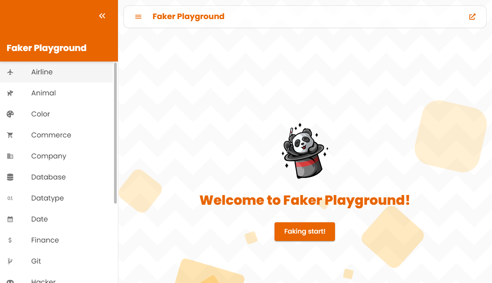

# Faker Playground 🪄

A Next.js application to play with [**Faker.js**](https://fakerjs.dev/) 🪄

👉 [**LIVE APPLICATION HERE**](#) 🚀



This project is primarily built with Next.js, Typescript, Material UI, and Tailwind CSS. Prettier and ESLint are used for code formatting and linting.

## Installation

```bash
pnpm install
```

## Development

```bash
pnpm run dev
```
